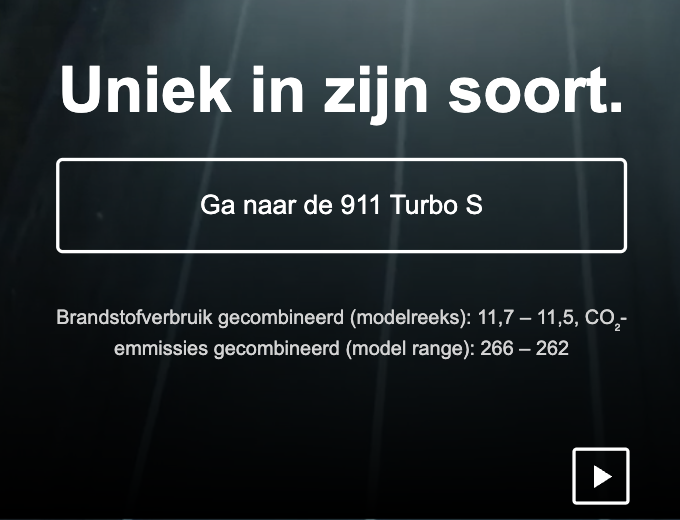
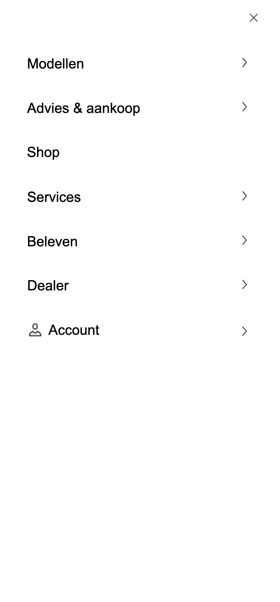
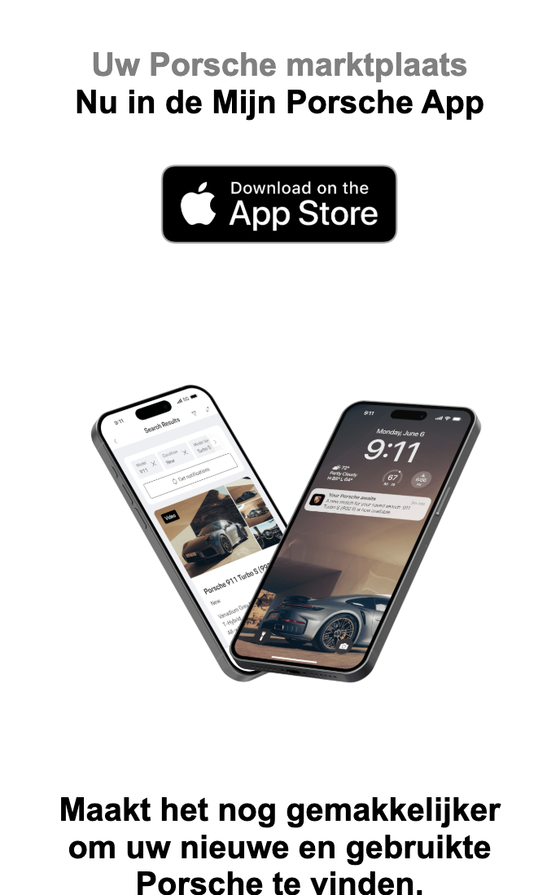

# Procesverslag
Markdown is een simpele manier om HTML te schrijven.  
Markdown cheat cheet: [Hulp bij het schrijven van Markdown](https://github.com/adam-p/markdown-here/wiki/Markdown-Cheatsheet).

Nb. De standaardstructuur en de spartaanse opmaak van de README.md zijn helemaal prima. Het gaat om de inhoud van je procesverslag. Besteedt de tijd voor pracht en praal aan je website.

Nb. Door *open* toe te voegen aan een *details* element kun je deze standaard open zetten. Fijn om dat steeds voor de relevante stuk(ken) te doen.

## Jij

  
uitwerken voor kick-off werkgroep

  ### Auteur:
  Jasper Broekman

  #### Je startniveau:
  Rood

  #### Je focus:
  Surface Plane
 

## Je website

  
uitwerken voor kick-off werkgroep

  ### Je opdracht:
  https://www.porsche.com/netherlands/nl/

  #### Screenshot(s) van de eerste pagina (small screen): 
  Homepage  
  
  
  
  

  #### Screenshot(s) van de tweede pagina (small screen):
   
  
  
  
  
 

## Toegankelijkheidstest 1/2 (week 1)

  
uitwerken na test in 2e werkgroep

  ### Bevindingen
  Lijst met je bevindingen die in de test naar voren kwamen:
  1: Tijdens de toegankelijkheids test heb ik eerst gekeken hoe het was om de site te gebruiken met een beperking. eerst had ik een bril op waardoor ik een stuk minder kon zien. Dit maakte het wel lastiger om de site te gebruiken maar de site is al redelijk goed ingericht en de kleuren staan goed tegenover elkaar. O

  Verder heb ik nog geprobeerd om de site te gebruiken met mijn vingers aan elkaar door een elastieken band waardoor typen een stuk lastiger ging. Maar ook dit was niet echt een probleem voor de site omdat de meeste buttons in het midden zitten en je voor de rest voornamelijk scrolled door de website wat ook niet al te moeilijk is.

  Als laatste heb ik de site nog gechecked met een speciale website die toegankelijkheid test. De Porsche site scoorde hierop met 70% een ruim voldoende. Ik denk dat dit best goed is als ik het vergelijk met resultaten van andere websites. De verbeterpunten zaten hem vooral in de toegankelijkheid voor de screenreader omdat bepaalde Linkteksten niet duidelijk genoeg waren. Ik denk dat dit voor een website die hoogstwaarschijnlijk gemaakt is met een pagebuilder een best goede uitkomst is.

  

## Breakdownschets (week 1)

  
uitwerken na afloop 3e werkgroep

  ### de hele pagina: 
  

  ### dynamisch deel (bijv menu): 
  

## Voortgang 1 (week 2)

  
uitwerken voor 1e voortgang

  ### Stand van zaken
  hier dit ging goed & dit was lastig (neem ook screenshots op van delen van je website en code)

  ### Agenda voor meeting
  samen met je groepje opstellen

  | student 1      | student 2          | student 3    | student 4        |
  | ---            | ---                | ---          | ---              |
  | dit bespreken  | en dit             | en ik dit    | en dan ik dat    |
  | en dat ook nog | dit als er tijd is | nog een punt | dit wil ik zeker |
  | ...            | ...                | ...          | ...              |

  ### Verslag van meeting
  hier na afloop snel de uitkomsten van de meeting vastleggen

  - Elke section een H2 geven voor screenreader
  - JS alleen in JS bestand en niet in HTML
  - Nav binnen Header

## Voortgang 2 (week 3)

  
uitwerken voor 2e voortgang

  ### Stand van zaken
  hier dit ging goed & dit was lastig (neem ook screenshots op van delen van je website en code)

  ### Agenda voor meeting
  samen met je groepje opstellen

  | student 1      | student 2          | student 3    | student 4        |
  | ---            | ---                | ---          | ---              |
  | dit bespreken  | en dit             | en ik dit    | en dan ik dat    |
  | en dat ook nog | dit als er tijd is | nog een punt | dit wil ik zeker |
  | ...            | ...                | ...          | ...              |

  ### Verslag van meeting
  hier na afloop snel de uitkomsten van de meeting vastleggen

  - punt 1
  - punt 2
  - nog een punt
- ...

## Toegankelijkheidstest 2/2 (week 4)

  
uitwerken na test in 9e werkgroep

  ### Bevindingen
  Ik heb de WCAG checklist ingevuld en daaruit blijkt dat mijn site al beter scoord dan die van porsche. 

  Tijdens het toetsen van mijn site aan de WCAG-checklist heb ik gekeken naar hoe toegankelijk mijn site tot nu toe is. Ik heb de taalinstellingen goed staan en de site is op mobiel goed leesbaar.

  Op het gebied van media scoort de site goed door de pauzeknop voor de video. Hierdoor voldoe ik aan de richtlijn dat gebruikers bewegende beelden moeten kunnen stopzetten. Ook de contrasten zijn overal voldoende en ik heb een tekst-vergroter toegevoegd waarmee de gebruiker zelf de leesbaarheid kan aanpassen. Dit maakt de site een stuk vriendelijker voor mensen met een visuele beperking.

  De belangrijkste verbeterpunten zitten in de keyboard-navigatie; de 'focus' is nu niet goed zichtbaar als je met de Tab-toets door de site gaat. Ook voor screenreaders valt er nog wat te verbeteren door paginatitels unieker te maken en decoratieve afbeeldingen een lege alt-tekst te geven. De basis is dus al prima.

## Voortgang 3 (week 4)

  
uitwerken voor 3e voortgang

  ### Stand van zaken
  hier dit ging goed & dit was lastig (neem ook screenshots op van delen van je website en code)

  ### Agenda voor meeting
  samen met je groepje opstellen

  | student 1      | student 2          | student 3    | student 4        |
  | ---            | ---                | ---          | ---              |
  | dit bespreken  | en dit             | en ik dit    | en dan ik dat    |
  | en dat ook nog | dit als er tijd is | nog een punt | dit wil ik zeker |
  | ...            | ...                | ...          | ...              |

  ### Verslag van meeting
  hier na afloop snel de uitkomsten van de meeting vastleggen

  - animatie bij het inlaten komen van je header
  - carrousel in het midden uitlijnen

## Eindgesprek (week 5)

  
uitwerken voor eindgesprek

  ### Je uitkomst - karakteristiek screenshots:
  

  ### Dit ging goed/Heb ik geleerd: 
  Er zijn verschillende dingen die ik heb geleerd, maar de tofste vind ik het hamburger menu en de pauze/speel knop. Bij deze dingen maak je namelijk echt een combinatie van alle 3 de soorten code en het resultaat wat ik hiermee bereikt heb is volgens mij prima gelukt.

  
  

  ### Dit was lastig/Is niet gelukt:
  het is mij helaas niet gelukt om een scroll effect toe te passen, ik wilde dit graag doen op de twee telefoon afbeeldingen.
  ik heb het twee uur geprobeerd. Ik heb geprobeerd tuturials op te zoeken en ik heb het aan chatGPT gevraagd maar niks werkte echt goed. 
  Ik ben wel op een punt gekomen waar de afbeeldingen bewogen bij het scrollen, maar dan werd de styling helemaal door de war gehaald.

  

## Bronnenlijst

  
continu bijhouden terwijl je werkt

  1. Ik heb aan ChatGPT gevraagd of hij een pauze en startknop kon vormgeven in svg vorm
  2. ik kon de images niet selecteren dus ik heb aan chatGPT gevraagd waarom niet en hoe ik dit kan oplossen

